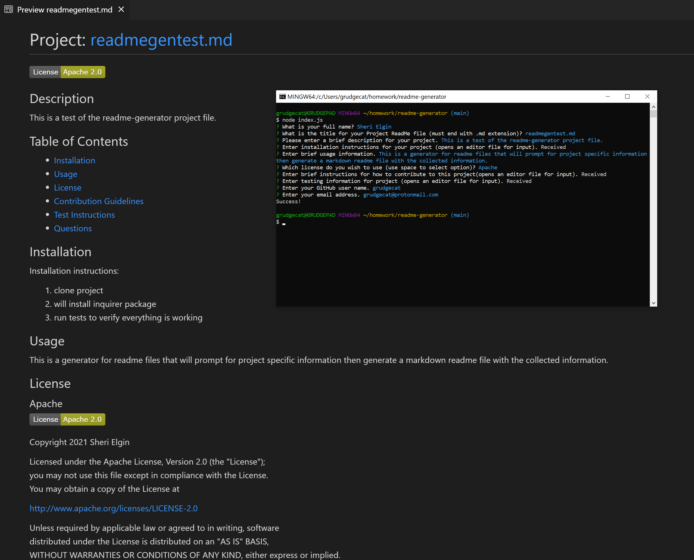

# TITLE: README FILE GENERATOR

## Project Function:  
Command-line application to dynamically generate Read Me files.  

## Project Title: # readme-generator
Purpose: This project was created to explore JavaScript ES6, node, module imports, dynamic file generation and to improve skills working with functions. 

**Creation date:** July 2021  
**Collaborators:** Sheri Elgin

## Screen Cap


## Project Links
GitHub Source Code: https://github.com/grudgecat/readme-generator  \
Demo Video link: 

***
## Dependencies 
node.js https://nodejs.org/en/  
npm package inquirer: https://www.npmjs.com/package/inquirer#questions
```
